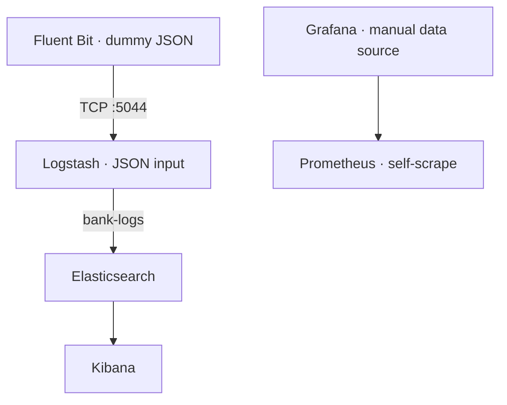

<h1 align="center">Docker Observability Stack</h1>
<p align="center">
  A local Docker Compose demo for log ingestion and metrics exploration.
</p>
<p align="center">
  
  
  
  
  
</p>
<p align="center">
  <a href="#overview">Overview</a> ·
  <a href="#features">Features</a> ·
  <a href="#quick-start">Quick Start</a> ·
  <a href="#explore-the-stack">Explore the Stack</a> ·
  <a href="#architecture">Architecture</a> ·
  <a href="#known-issues">Known Issues</a>
</p>

---

# Overview
Run **Fluent Bit, Logstash, Elasticsearch, Kibana, Prometheus, and Grafana** with one Compose file. Fluent Bit emits a built-in example event, Logstash forwards it to Elasticsearch, and Kibana lets you inspect the indexed document. Separately, Prometheus collects its own metrics and Grafana provides a dashboard interface.
> **Scope:** The included configuration demonstrates a log pipeline and a metrics service. Prometheus is configured to scrape itself only; it does not yet ingest host, container, or application metrics.

---

# Features
| | Feature | Implementation |
| :---: | --- | --- |
| 📦 | One-command startup | Root `docker-compose.yml` defines all six services |
| 📨 | Sample log generation | Fluent Bit `dummy` input produces a JSON event |
| 🔄 | Log processing | Fluent Bit sends TCP JSON to Logstash on port 5044 |
| 🔍 | Log search | Logstash indexes events into Elasticsearch as `bank-logs` |
| 📊 | Log exploration | Kibana connects to Elasticsearch |
| 📈 | Metrics exploration | Prometheus self-scrape and Grafana UI |

The bank event is **synthetic sample data**. No live banking application or host log collection is configured.

---

# Quick Start
## 1. Prepare your environment
- Install Docker with the **Compose plugin** so `docker compose` works.
- Start Docker Desktop or the Docker Engine.
- Keep ports **9200**, **5601**, **5044**, **9090**, and **3001** available on your machine.
- Allow time for image downloads and Elasticsearch startup.

From the repository root, check your installation and configuration:

```sh
docker --version
docker compose version
docker compose config
```

## 2. Start the stack
Run this **from the repository root**, next to `docker-compose.yml`:

```sh
docker compose up -d
docker compose ps
```

The root Compose file already defines Prometheus and Grafana. **Do not also start** `prometheus/docker-compose.yml`: it duplicates the services and uses relative mount paths based on a different directory.

## 3. Check the services
| Service | Address on your machine | What to check |
| --- | --- | --- |
| Elasticsearch | [http://localhost:9200](http://localhost:9200) | JSON response from the search API |
| Kibana | [http://localhost:5601](http://localhost:5601) | UI loads; discover `bank-logs` documents |
| Prometheus | [http://localhost:9090](http://localhost:9090) | Status → Targets shows the Prometheus target |
| Grafana | [http://localhost:3001](http://localhost:3001) | Login page loads; add Prometheus manually if needed |
| Logstash TCP input | `localhost:5044` | Published ingestion port, not a browser page |

If the sample log takes time to appear, inspect service logs:

```sh
docker compose logs --tail=100 fluent-bit logstash elasticsearch
```

You can also inspect the configured index from a terminal:

```sh
curl http://localhost:9200/bank-logs/_count
```

Kibana may need a data view for `bank-logs` before you can explore the records. This demo sends the sample event repeatedly, so document counts may grow while the stack runs.

## 4. Stop the stack
```sh
docker compose down
```

The Compose file has no persistent volume configured for Elasticsearch or Grafana. Data stored in their container filesystems may be lost when containers are removed.

<details>
<summary><strong>Troubleshooting</strong></summary>

| Symptom | Check |
| --- | --- |
| `docker compose` is unavailable | Confirm Docker and its Compose plugin are installed and running. |
| A port is already allocated | Stop the other program or adjust the published host port in the root Compose file. |
| Kibana opens but no documents appear | Allow Elasticsearch and Logstash to start, then check `docker compose logs --tail=100 fluent-bit logstash`. |
| Grafana has no Prometheus metrics | No Grafana data source is provisioned; add Prometheus with URL `http://prometheus:9090` inside Grafana. |
| Host metrics are missing | No Node Exporter or host-metrics scrape target is defined in this repository. |
| A second Compose command creates conflicts | Run the stack only from the repository root; the nested Compose file duplicates it. |

**Validation:** The README was checked against the supplied Compose and pipeline configuration. Docker is not installed in the review environment, so startup and event delivery were not verified here.

</details>

---

# Explore the Stack
| Step | Action |
| --- | --- |
| **1** | Open Elasticsearch or query `bank-logs/_count` to check indexing. |
| **2** | In Kibana, create a data view for `bank-logs` if prompted, then explore the sample events. |
| **3** | Open Prometheus and check the `prometheus` target; try the expression `up`. |
| **4** | Open Grafana at **port 3001**, add a Prometheus data source pointing to `http://prometheus:9090`, and build a panel. |

<details>
<summary><strong>Service and port reference</strong></summary>

| Service | Image in Compose | Container port | Host port |
| --- | --- | ---: | ---: |
| Elasticsearch | `docker.elastic.co/elasticsearch/elasticsearch:8.11.0` | 9200 | 9200 |
| Kibana | `docker.elastic.co/kibana/kibana:8.11.0` | 5601 | 5601 |
| Logstash | `docker.elastic.co/logstash/logstash:8.11.0` | 5044 | 5044 |
| Fluent Bit | `fluent/fluent-bit:2.1` | — | — |
| Prometheus | `prom/prometheus:latest` | 9090 | 9090 |
| Grafana | `grafana/grafana:latest` | 3000 | **3001** |

`5044` is configured as a **TCP JSON** input in Logstash. It is not configured as a Beats input.

</details>

---

# Architecture


| Configuration | Responsibility |
| --- | --- |
| `docker-compose.yml` | Defines the six services, ports, mounts, and shared network |
| `fluent-bit/fluent-bit.conf` | Dummy JSON input and TCP output to Logstash |
| `logstash/pipeline/logstash.conf` | TCP JSON input and Elasticsearch `bank-logs` output |
| `prometheus/prometheus.yml` | 15-second scrape interval and Prometheus self-target |
| `prometheus/docker-compose.yml` | Duplicate of the root Compose file; not needed for startup |

---

# Project Files
| Path | Contents |
| --- | --- |
| `README.md` | Project documentation |
| `docker-compose.yml` | Main Compose configuration |
| `fluent-bit/` | Fluent Bit pipeline configuration |
| `logstash/pipeline/` | Logstash processing configuration |
| `prometheus/` | Prometheus scrape configuration and duplicate Compose file |

---

# Known Issues
**Local demo configuration:** Elasticsearch security is disabled and service ports are published on the host. Use it on a trusted local machine; review access settings before exposing it on a network.

<details>
<summary><strong>View source review findings</strong></summary>

| Area | Finding |
| --- | --- |
| Duplicate Compose | `prometheus/docker-compose.yml` repeats the root file and references relative mounts that do not match its location. |
| Metrics coverage | Prometheus scrapes `localhost:9090` from its container; no Node Exporter or application target is configured. |
| Grafana setup | No data source or dashboard is provisioned. |
| Log source | Fluent Bit uses a dummy event, not files, container logs, or a live producer. |
| Documentation drift | Earlier README said Grafana was on port 3000, Fluent Bit printed metrics to stdout, and Logstash used Beats; the current files configure port 3001, TCP output, and TCP JSON input. |
| Persistence | Elasticsearch and Grafana have no named data volumes. |
| Image versions | Prometheus and Grafana use mutable `latest` tags. |
| Verification | No automated end-to-end check or dashboard export is included. |

</details>

---

# Roadmap
- Remove the duplicate Compose file and keep paths relative to one project root.
- Provision a Grafana data source and a starter dashboard.
- Add a real log source and verify the indexed event format.
- Add an exporter and its target for host or container metrics.
- Configure persistent data volumes and predictable image tags.
- Add a repeatable health and ingestion check.

---

# Contributing
Open an issue or submit a focused pull request. Include the relevant Compose service, reproduction steps, and sanitized log output when reporting a problem.

# License
The supplied archive contains no `LICENSE` file. Maintainers should document the repository license and verify terms for any assets added later.

---

<p align="center"><a href="#docker-observability-stack">Back to top ↑</a></p>
